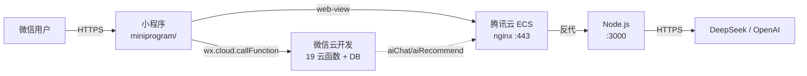

# 健康生活助手 - 腾讯云 ECS 部署手册

> **适用场景**：个人主体小程序 + 工具-健康类目 + 腾讯云大陆 ECS
> **预计耗时**：2-3 周（ICP 备案 10-15 天 + 部署 1 天 + 审核 1-3 天）
> **文档版本**：v1.0 · 2026-06-03

---

## 0. 架构与前置条件



| # | 准备项 | 用途 | 备注 |
|---|---|---|---|
| 1 | 微信小程序 AppID | 小程序身份 | `wxf384de5176507594`（已配置） |
| 2 | 个人主体认证 | 类目：工具-健康管理 | 个人即可 |
| 3 | 微信云开发（包年） | 云函数 + 数据库 | 首次开通拿 env ID |
| 4 | 腾讯云 ECS（2C4G+） | 后端服务 | 推荐 CentOS 7+ / Ubuntu 20+ |
| 5 | 域名 + ICP 备案 | HTTPS 入口 | .cn 约 ¥30/年，备案 10-15 天 |
| 6 | SSL 证书（DV） | HTTPS 加密 | 腾讯云免费 TrustAsia |
| 7 | LLM API Key | AI 助手 | DeepSeek ¥1/百万 token（推荐） |

---

## 1. 域名 + ICP 备案（10-15 天，关键路径）

### 1.1 买域名
- 腾讯云 [DNSPod](https://console.dnspod.cn) 购买 `.cn` 域名（便宜）
- 实名认证 1 天
- 假设你的域名是 `example.cn`

### 1.2 提交 ICP 备案
- 腾讯云 [备案系统](https://console.cloud.tencent.com/beian)
- 个人主体：身份证 + 人脸核验
- 网站名称：`健康生活助手`
- 网站服务内容：`工具类 → 健康数据记录`
- 备案期间 ECS 只能用 HTTP 调试（端口 80/8080），**正式 HTTPS 需等备案下来**

### 1.3 SSL 证书
- 腾讯云 [SSL 证书](https://console.cloud.tencent.com/ssl) → 申请免费证书
- DNS 验证（添加 CNAME）→ 20 分钟签发
- 下载 **Nginx** 格式（`fullchain.pem` + `privkey.pem`）

---

## 2. ECS 初始化（5 条命令）

SSH 登录 ECS（root 用户）：

```bash
# 1) 更新系统
yum update -y                # CentOS
# apt update && apt upgrade -y  # Ubuntu

# 2) 安装 Docker
curl -fsSL https://get.docker.com | sh
systemctl enable docker && systemctl start docker

# 3) 创建部署目录
mkdir -p /opt/sugar-server && cd /opt/sugar-server

# 4) 上传项目代码（选一种）

# 方式 A: scp 从本机（在本机 PowerShell 执行）
# scp -r .\server   root@<ECS_IP>:/opt/sugar-server/
# scp -r .\docs     root@<ECS_IP>:/opt/sugar-server/

# 方式 B: git 克隆（推荐，先把项目推到 GitHub 私有仓）
# git clone https://github.com/your/repo.git .

# 5) 验证
docker --version
docker compose version
```

---

## 3. 配置后端环境变量

```bash
cd /opt/sugar-server/server
cp .env.production.example .env.production
nano .env.production
```

填入（**`API_KEY` 用 `openssl rand -hex 32` 生成**）：

```bash
PORT=3000
NODE_ENV=production

API_KEY=<32位随机字符串>

LLM_PROVIDER=openai-compatible
LLM_BASE_URL=https://api.deepseek.com/v1
LLM_API_KEY=<你的 DeepSeek key>
LLM_MODEL=deepseek-chat
LLM_TIMEOUT_MS=30000

DATA_DIR=./data
```

---

## 4. 上传 SSL 证书

```bash
# 本机执行 scp
scp fullchain.pem root@<ECS_IP>:/opt/sugar-server/server/nginx/ssl/
scp privkey.pem   root@<ECS_IP>:/opt/sugar-server/server/nginx/ssl/

# ECS 上设置权限
ssh root@<ECS_IP>
cd /opt/sugar-server/server
chmod 600 nginx/ssl/*
```

---

## 5. 一键部署后端（1 条命令）

```bash
cd /opt/sugar-server/server
chmod +x deploy.sh
bash deploy.sh --ssl-cert nginx/ssl/fullchain.pem --ssl-key nginx/ssl/privkey.pem
```

**deploy.sh 自动完成**：① Docker 检查 ② 配置校验 ③ 证书安装 ④ 拉代码 ⑤ 重建容器 ⑥ 健康检查

**成功的标志**：
```
部署成功 ✓
sugar-app    running   healthy
sugar-nginx  running
```

---

## 6. 部署法律文档（静态文件）

修改 `server/docker-compose.yml`，给 nginx 容器加一个 volume：

```yaml
  nginx:
    volumes:
      - ./nginx/nginx.conf:/etc/nginx/nginx.conf:ro
      - ./nginx/ssl:/etc/nginx/ssl:ro
+     - ../docs/legal:/usr/share/nginx/html/legal:ro   # 新增
```

然后在 `server/nginx/nginx.conf` 的 `location /` **之前**加：

```nginx
    # 法律文档
    location /legal/ {
        root /usr/share/nginx/html;
        access_log off;
    }
```

重启：

```bash
docker compose restart nginx
curl https://example.cn/legal/user-agreement.html   # 验证可访问
```

---

## 7. 配置微信云开发

### 7.1 开通 + 拿 env ID
1. 微信开发者工具 → 顶部"云开发" → 开通（**选包年**）
2. 创建环境，记下 **env ID**（如 `sugar-guardian-prod-1`）

### 7.2 创建数据库集合
云开发控制台 → 数据库 → 创建：`users` / `families` / `meals` / `exercises` / `blood_sugars` / `likes`

### 7.3 批量部署 19 个云函数
对 `cloud/functions/` 下每个子目录：
- 右键 → **上传并部署：云端安装依赖**（首次，会自动装 `wx-server-sdk`）

### 7.4 配置云函数环境变量
云开发控制台 → 云函数 → 选 `aiChat` / `aiRecommend` / `aiAnalysis` → 配置：

| 变量 | 值 |
|---|---|
| `BACKEND_URL` | `https://example.cn/api/v1` |
| `BACKEND_KEY` | **与 `.env.production` 的 `API_KEY` 完全一致** |

### 7.5 修改小程序 env ID
```bash
# 编辑 miniprogram/app.js
sed -i "s/your-env-id/sugar-guardian-prod-1/" miniprogram/app.js
```

### 7.6 修改小程序法律 URL
```bash
# 编辑 miniprogram/pages/legal/legal.js
sed -i "s/YOUR_DOMAIN/example.cn/" miniprogram/pages/legal/legal.js
```

---

## 8. 配置小程序合法域名

[微信公众平台](https://mp.weixin.qq.com) → 开发管理 → 开发设置 → 服务器域名：

| 类型 | 域名 |
|---|---|
| request 合法域名 | `https://example.cn` |
| uploadFile 合法域名 | `https://example.cn`（如需上传） |

---

## 9. 体验版测试

1. 微信开发者工具 → 编译 → 右上角**预览** → 扫码
2. 用真机测试账号跑通核心流程：
   - 登录（验证云函数 OK）
   - 记饮食 / 运动 / 指标（验证云函数 → 反代 → ECS 链路）
   - 触发 AI 推荐（验证 LLM 路径）
   - 拔网后 AI 助手应 fallback 到本地建议
   - 我的 → 关于 → 3 个法律链接能打开

---

## 10. 提交审核

### 10.1 准备材料
- 5 张真机截图（首页、记录、AI 助手、家庭、我的）
- 类目：**工具 → 健康管理（工具型）**
- 服务类目描述：`健康数据记录工具，不涉及医疗诊断`

### 10.2 服务内容声明
公众平台 → 设置 → 服务内容声明：
- 用户协议：`https://example.cn/legal/user-agreement.html`
- 隐私政策：`https://example.cn/legal/privacy-policy.html`
- 用户隐私保护指引：勾选"收集用户健康数据"

### 10.3 上传 + 提审
1. 开发者工具 → 右上角**上传** → 版本 `1.0.0`、备注 `feat: 上线 MVP`
2. 公众平台 → 版本管理 → 审核版本 → 提交审核
3. 等待 **1-3 天**（个人主体）

---

## 11. 上线后运维

### 11.1 监控命令
```bash
cd /opt/sugar-server/server
docker compose logs -f app          # 实时日志
docker stats                        # 资源占用
watch -n 30 'curl -s https://example.cn/health'  # 健康检查
```

### 11.2 月度成本
| 项目 | 费用 |
|---|---|
| ECS 2C4G | ¥80-150/月 |
| 域名 | ¥30-80/年 |
| 云开发付费版 | ¥199/月（基础） |
| DeepSeek API | ¥3-10 / 千次推荐 |
| **合计** | **¥300-400/月 + 流量** |

### 11.3 LLM 限流（防账单爆）
云函数 → `aiChat` / `aiRecommend` → 配置：
- 单用户每分钟最多 5 次
- 整个云函数每分钟最多 100 次

---

## 12. 常见问题 FAQ

**Q1：备案期间能先测试吗？**
A：可以。用 `http://<ECS_IP>:3000/health` 直接测 ECS，但小程序生产环境必须域名 + HTTPS。

**Q2：部署后 502 Bad Gateway？**
A：app 容器没起来。`docker compose logs app` 看错误。常见原因：
- `.env.production` 漏填 `API_KEY` / `LLM_API_KEY`
- LLM key 无效
- 端口被占

**Q3：小程序访问后端 404？**
A：检查 3 处：
- 公众平台合法域名是否加了 `https://example.cn`
- 云函数 `BACKEND_URL` 是否正确
- nginx 容器是否启动：`docker compose ps`

**Q4：AI 一直"本地建议"？**
A：LLM 路径断开。检查：
- `curl https://api.deepseek.com/v1/models` 验证外网
- `.env.production` 中 `LLM_API_KEY` 有效性
- `docker compose logs app | grep LLM`

**Q5：想换 LLM？**
A：改 `.env.production` 的 `LLM_BASE_URL` / `LLM_API_KEY` / `LLM_MODEL`，重启即可。兼容所有 OpenAI 格式（通义千问、智谱、豆包、Ollama）。

**Q6：想更新代码？**
A：本地修改 → 推 git → ECS 拉取 → `bash deploy.sh`。整个过程 ~1 分钟。

**Q7：数据备份？**
A：`/opt/sugar-server` 整个目录用 `tar` 打包，定期传到对象存储（COS）。

**Q8：想用企业主体？**
A：去 [微信公众平台](https://mp.weixin.qq.com) 完成企业认证，可以申请医疗相关类目，提供更专业的服务描述。但需营业执照 + 对公账户验证，周期 1-2 周。

---

## 13. 一句话总结

> 备案 + 域名 + ECS + Docker + 5 条命令 = 上线 🎉
